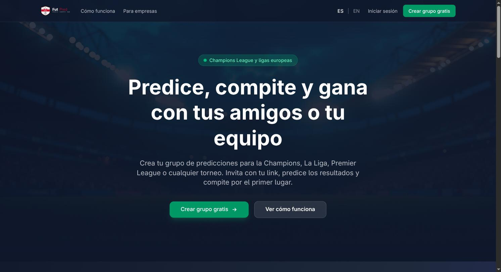
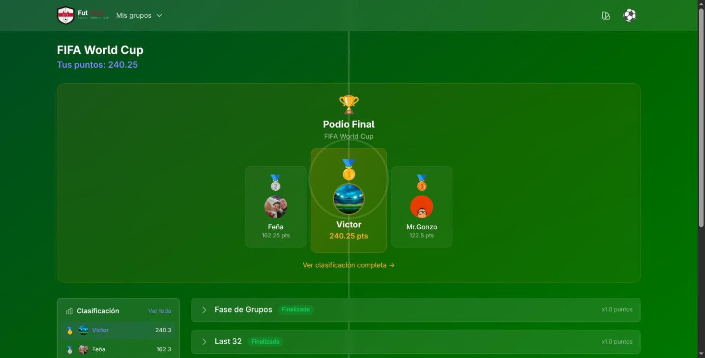
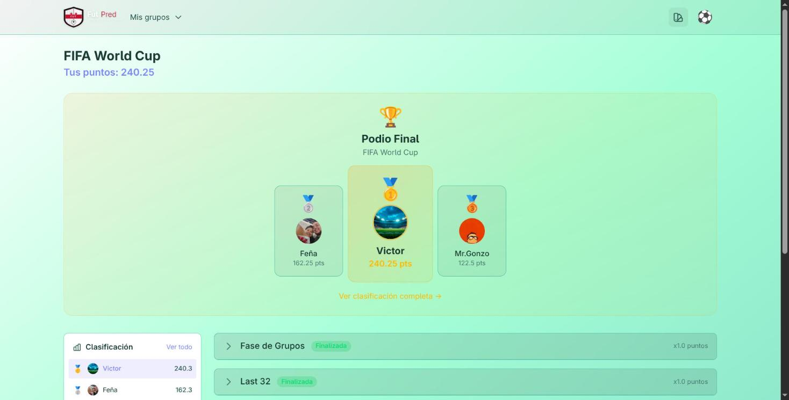
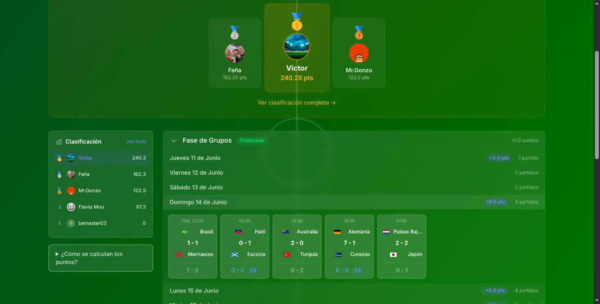

# FutPred ⚽

App de predicciones de fútbol / Football predictions app

🌐 **Live:** [futpred.com](https://futpred.com) · Available in English & Spanish · 3 themes (Dark, Light, Cancha)



### Inside the app

| Dark mode | Light mode |
|-----------|------------|
|  |  |



---

## 🇪🇸 Español

### ¿Qué es FutPred?

FutPred es una app para hacer predicciones de partidos de fútbol con tus amigos. Crea organizaciones, agrega torneos (como el Mundial 2026), y compite para ver quién predice mejor los resultados.

### Sistema de puntos

| Predicción | Puntos |
|------------|--------|
| Resultado exacto (ej: predijiste 2-1 y fue 2-1) | 5 pts |
| Acertaste quién gana (ej: predijiste 3-0 y fue 2-1) | 3 pts |
| No acertaste | 0 pts |

Los puntos se multiplican según la fase: Grupos x1, Cuartos x1.5, Semis x1.75, Final x2

### Requisitos

- Docker y Docker Compose

### Probar rápido (sin clonar)

```bash
# Descargar docker-compose de producción
curl -O https://raw.githubusercontent.com/victoravellog/futpred/master/docker-compose.prod.yml

# Iniciar (descarga la imagen automáticamente)
docker compose -f docker-compose.prod.yml up
```

Abre http://localhost:3000 y crea tu cuenta.

### Instalación para desarrollo

```bash
# Clonar el repositorio
git clone https://github.com/tu-usuario/futpred.git
cd futpred

# Iniciar todos los servicios
docker compose up

# En otra terminal, crear la base de datos (solo la primera vez)
docker compose exec web bin/rails db:create db:migrate

# Opcional: cargar datos del Mundial 2026
docker compose exec web bin/rails db:seed
```

Abre http://localhost:3000 y crea tu cuenta.

### Comandos útiles

```bash
# Iniciar en segundo plano
docker compose up -d

# Ver logs
docker compose logs -f web

# Consola de Rails
docker compose exec web bin/rails console

# Correr tests
docker compose exec web bundle exec rspec

# Detener todo
docker compose down
```

---

## 🇬🇧 English

### What is FutPred?

FutPred is a football predictions app to play with your friends. Create organizations, add tournaments (like the 2026 World Cup), and compete to see who predicts results best.

### Scoring system

| Prediction | Points |
|------------|--------|
| Exact score (e.g.: predicted 2-1 and it was 2-1) | 5 pts |
| Correct winner (e.g.: predicted 3-0 and it was 2-1) | 3 pts |
| Wrong prediction | 0 pts |

Points are multiplied by phase: Groups x1, Quarter-finals x1.5, Semi-finals x1.75, Final x2

### Requirements

- Docker and Docker Compose

### Quick start (no cloning)

```bash
# Download production docker-compose
curl -O https://raw.githubusercontent.com/victoravellog/futpred/master/docker-compose.prod.yml

# Start (downloads image automatically)
docker compose -f docker-compose.prod.yml up
```

Open http://localhost:3000 and create your account.

### Development installation

```bash
# Clone the repository
git clone https://github.com/your-username/futpred.git
cd futpred

# Start all services
docker compose up

# In another terminal, create the database (first time only)
docker compose exec web bin/rails db:create db:migrate

# Optional: load 2026 World Cup data
docker compose exec web bin/rails db:seed
```

Open http://localhost:3000 and create your account.

### Useful commands

```bash
# Start in background
docker compose up -d

# View logs
docker compose logs -f web

# Rails console
docker compose exec web bin/rails console

# Run tests
docker compose exec web bundle exec rspec

# Stop everything
docker compose down
```

---

## Stack

- **Backend**: Rails 8
- **Frontend**: Hotwire (Turbo + Stimulus), Tailwind CSS
- **Database**: PostgreSQL
- **Jobs**: Sidekiq + Redis
- **Testing**: RSpec

## Deploy

- **Railway**: Ver [docs/DEPLOY_RAILWAY.md](docs/DEPLOY_RAILWAY.md)
- **Docker**: Usar `docker-compose.prod.yml`

## License

MIT
